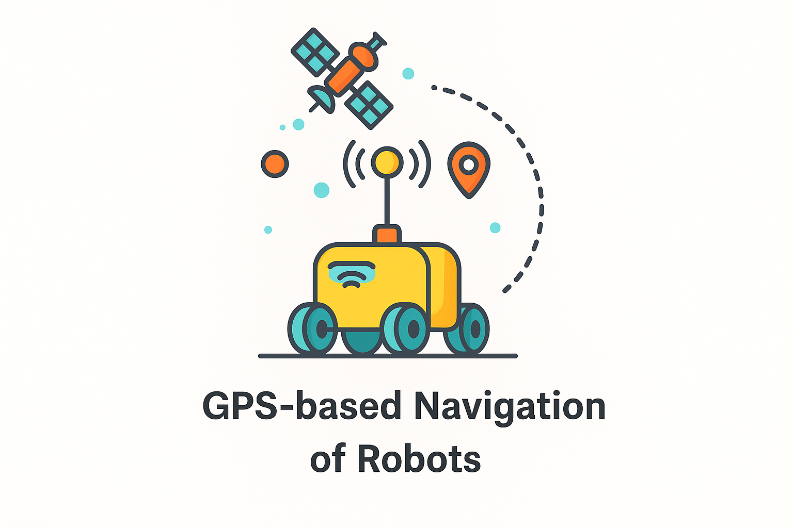

<div align="center">
  
  <br>
</div>

# Project Instructions


## Overview
This project involves launching a UGV (Unmanned Ground Vehicle) in a simulated world and using GPS navigation scripts to control its movement.

## Instructions

## Prerequisites

### 1. Install ROS (Robot Operating System)
### 2. Install Husky Packages

#### Create a Catkin Workspace

```bash
mkdir -p ~/catkin_ws/src
cd ~/catkin_ws/
catkin_make
```
#### Install Husky Simulation Packages

```bash
sudo apt update
sudo apt install ros-noetic-husky-simulator ros-noetic-husky-navigation
```
#### Build the Workspace
```bash
cd ~/catkin_ws
catkin_make
source ~/catkin_ws/devel/setup.bash
```

### Running the Project

1. **Launch the UGV in the World**
   ```bash
   cd ~/catkin_ws
   source ~/catkin_ws/devel/setup.bash
   roslaunch gps_navigation_husky gps_navigation.launch
   ```

2. **Launch the Navigation Script**
   ```bash
   cd ~/catkin_ws/src/gps_navigation_husky/Scripts/
   python3 target_navigation.py
   ```
---
### Hardware Deployment

<p>The same code architecture is compatible for deployment on real hardware for GPS-based navigation.</p>

<p align="center">
  <a href="https://www.youtube.com/watch?v=OlJv8bZSwIM&t=4s">
    
  </a>
</p>
